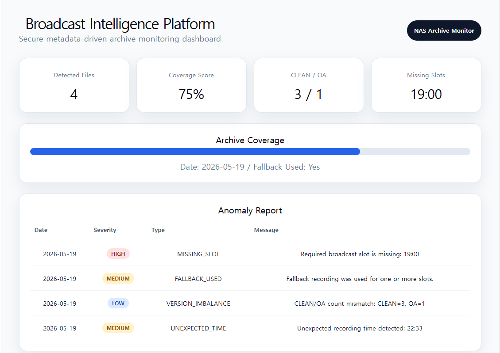

# Secure Broadcast Archive Intelligence Platform

> 放送アーカイブを、もっと構造化されたデータへ。  
> 방송 아카이브를 구조화된 데이터 시스템으로.

## Dashboard Preview




A metadata-driven broadcast archive analysis platform designed for secure NAS-based media environments.

---

## Overview

This project was inspired by real-world broadcast archive workflows in Japanese media environments.

The platform scans broadcast video files stored on NAS systems, extracts structured metadata from unstructured filenames, analyzes archive coverage, detects anomalies, and provides secure internal reporting APIs.

単純なファイル整理ではなく、  
放送アーカイブ環境における「構造化されていない映像データ」を  
分析可能なメタデータシステムへ変換することを目的としています。

단순 파일 정리가 아니라,  
방송 영상 운영 환경의 비정형 데이터를  
분석 가능한 메타데이터 시스템으로 변환하는 프로젝트입니다.

---

## Key Features

- Broadcast filename metadata parsing
- Program slot normalization
- CLEAN / OA version analysis
- Archive coverage monitoring
- Missing slot detection
- Fallback recording detection
- Unexpected recording anomaly analysis
- FastAPI-based reporting API
- Secure NAS-oriented architecture

---

## Example Workflow

```txt
NAS / Media Folder
    ↓
Metadata Scanner
    ↓
Coverage Analysis
    ↓
Anomaly Detection
    ↓
JSON Report
    ↓
FastAPI API Server
```

---

## Design Philosophy

### Metadata-first architecture

Instead of directly exposing raw media files,  
the platform transforms broadcast assets into structured metadata objects for safer and more scalable archive analysis.

### Security-oriented internal workflow

- NAS-based read-only scanning
- Path masking
- Internal-only API architecture
- Future secure video streaming support

---

## Future Roadmap

- React dashboard
- Secure video preview
- OCR-based subtitle extraction
- Japanese news summarization
- LLM-based metadata enrichment
- Broadcast timeline visualization
- Docker deployment

---

## Research Direction

This project explores how broadcast archive environments can be transformed into structured intelligence systems through metadata extraction, archive integrity monitoring, and secure media workflow design.

放送アーカイブを単なる保存領域ではなく、  
「分析可能なメディアデータ基盤」として再定義することを目指しています。